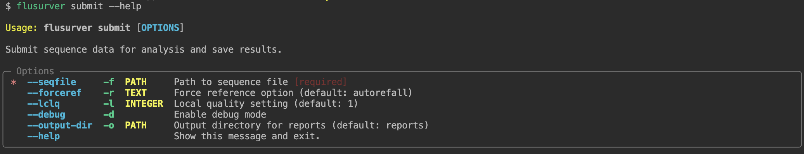

# FluSurver CLI

## Overview
FluSurver CLI is a command-line interface tool for submitting and analyzing influenza sequences using the FluSurver web service (https://flusurver.bii.a-star.edu.sg).

## Installation

It's not on pypi
```
pip install git+https://github.com/Joon-Klaps/flusurver-cli.git#egg=flusurver-cli
```

## Basic Command
```bash
flusurver submit -f <sequence_file> -o <output_dir>
```

### Available Options
```bash
$ flusurver submit --help
```


### Example
```bash
flusurver submit -f sequences.fasta -o results
```

## Output
The tool generates several report files in the specified output directory:
- `mutation_report`: Detailed mutation analysis
- `query_summary`: Summary of the query results
- `clade_call`: Clade classification results
- `drug_sensitivity`: Drug sensitivity analysis
